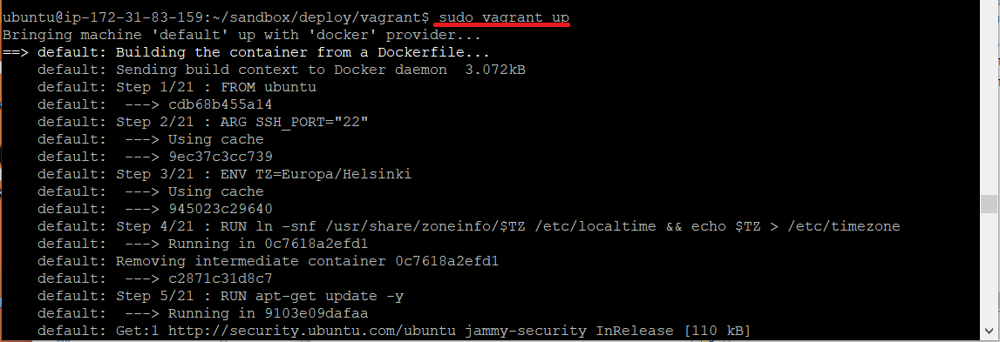
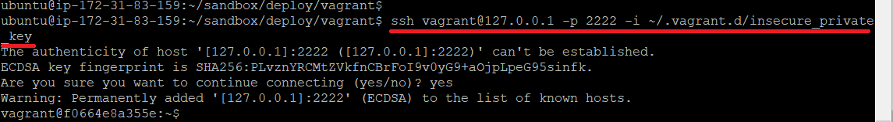
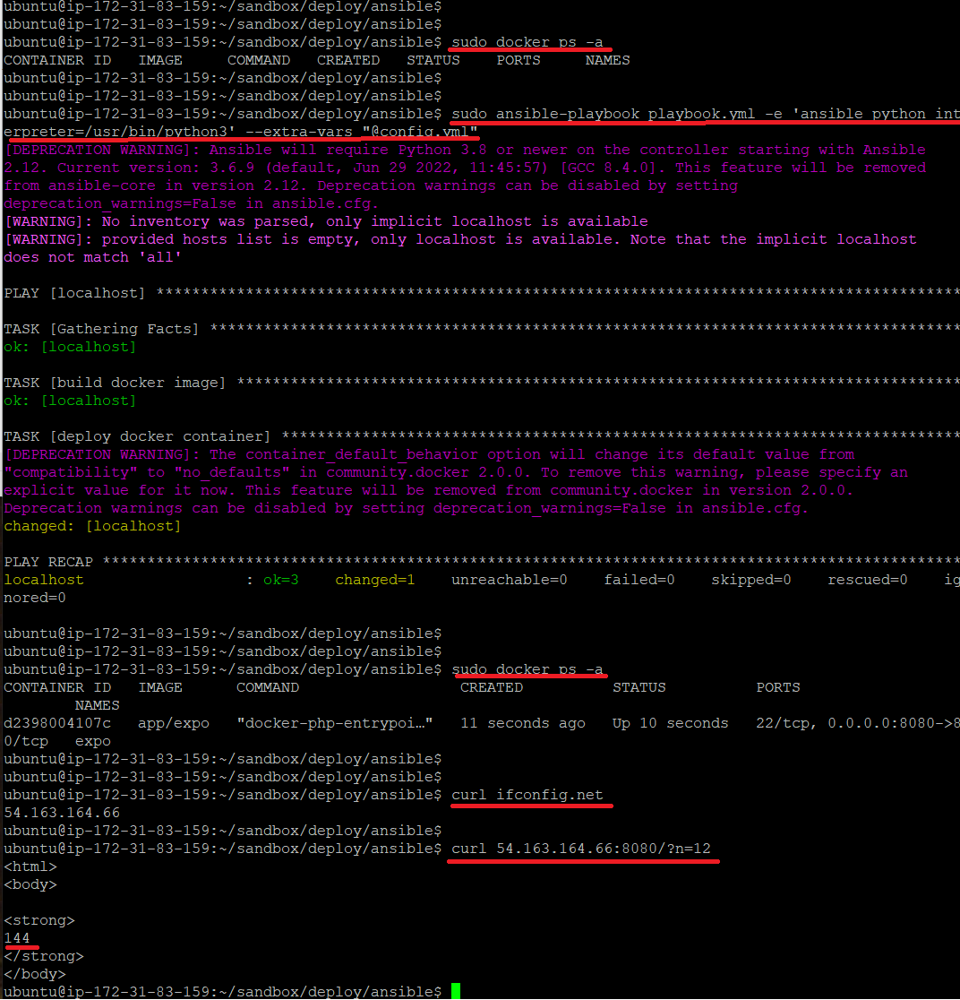

# About

vagrant and ansible container deploy 

# Prerequisites

### Required packages on host
- python
- ansible
- docker
- vagrant

# Installation
git clone https://github.com/DennySim/rightware.git

# Usage

### Vagrant deploy
Note: set your own environtment via deploy/vagrant/config.yaml

```
cd deploy/vagrant
vagrant up
```
Build image and deploy container

Check ssh access



### Ansible deploy
Note: set your own environtment via deploy/ansible/config.yml
```
cd deploy/ansible
ansible-playbook playbook.yml --extra-vars "@config.yml"
```
ansible deploy and check web-app

